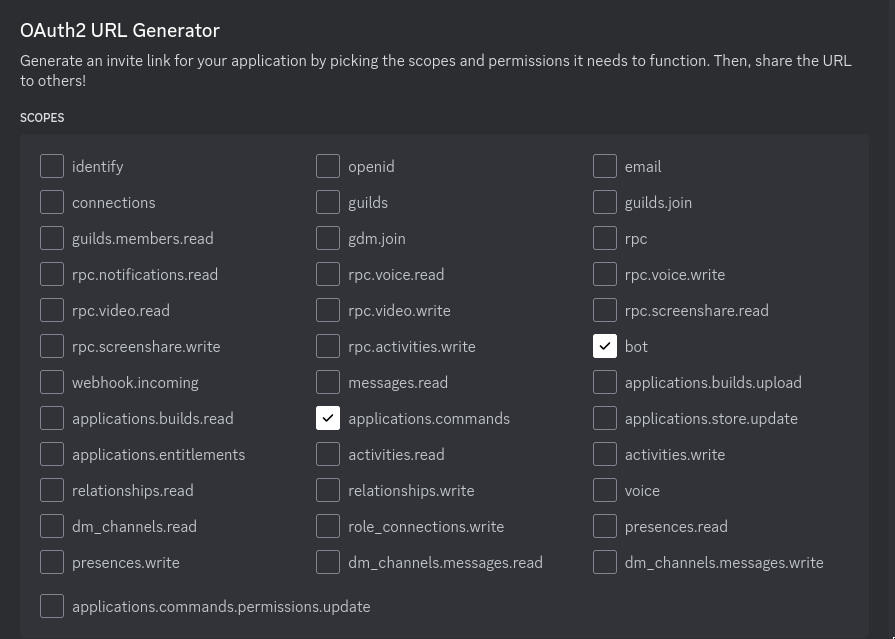
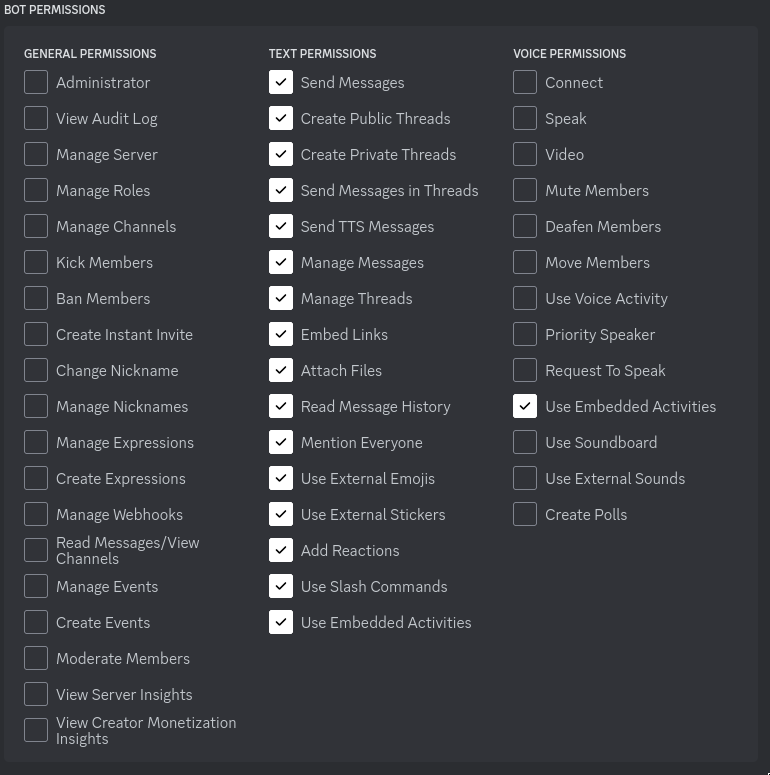

# MountainBot
Discord Bot for managing hiking trips


# Creating the Bot account and giving it permissions
Follow the guide [here](https://discordpy.readthedocs.io/en/stable/discord.html):

Then, when granting permissions, make sure you grant the following:  




# Run

Clone the repo
```
git clone https://github.com/belfastkeyboard/MountainBot
cd MountainBot
```

Create a file globals.py with relevant information like your bot token and channel id, for example:


```
token = "discordbottoken"
filepath = "jsonfilesecretsetc"
channel_id = 8888  # discord channel id
```

Run GNU make
```
make
```


If you created globals.py directly the bot is now running!
